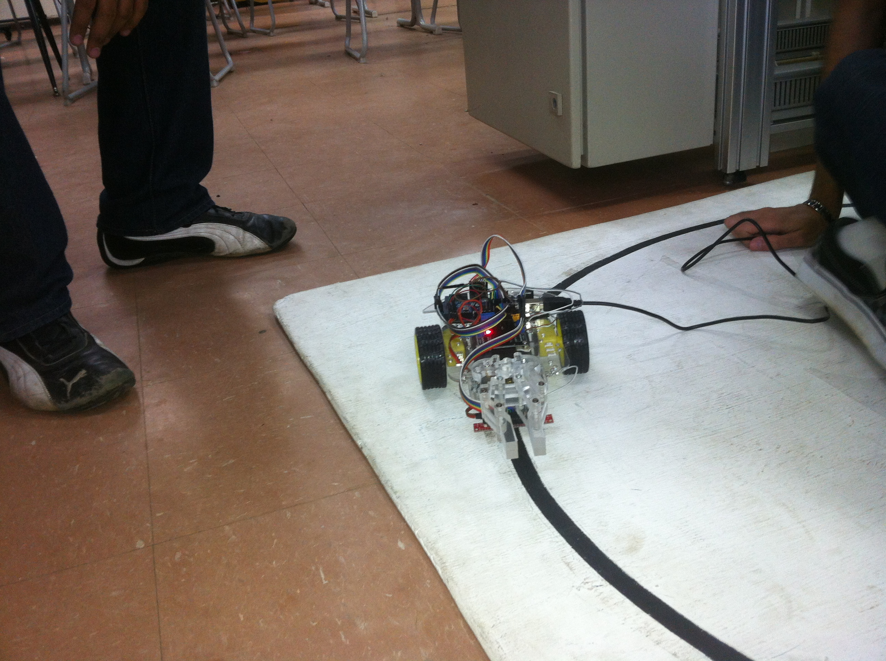

# Rover Bot, Hands-On Competition 2013 @ Intec

This is the code for the Rover Bot that won first place at [INTEC's](https://www.intec.edu.do/) Hands-On Competition of Fall 2013.

The purpose of the competition was to build a robot that could follow a black line on top of a white track, grab a box at the end, bring it back to the starting line and position it baed on its based on color.

The hardware consisted of an Arduino Microcontroller powered by a 9V battery, DC motors for the wheels, servo motors for the hand, and infrared sensors as the input signals.

The algorithm itself was a [PID Controller](https://en.wikipedia.org/wiki/PID_controller) implementation written in C that turned out to work better than expected and exceeded expectations. [Check the original, working, unmodified code here](./RoverBot.c). A variation of the following formula was used to calculate the output in the form of an integer number that would then to the motors and control the direction.

    

Check out one of the final runs at the actual competition:

* Software: Ronald Rey <mailto:reyronald@gmail.com>
* Hardware: Smailyn Peña <mailto:smailyn.p@gmail.com>

